# Engineering & Design Report: Personal Portfolio Website

**Course Assignment:** Personal Portfolio Development  
**Instructor:** Reaz Hassan Joarder, Junior Lecturer, Department of CSE  
**Student Name:** Abrar Faiyaz  
**Institution:** Islamic University of Technology (IUT), Bangladesh  
**Department:** Computer Science & Engineering (CSE)  
**Live Website:** [https://abrar-faiyaz07.github.io/Portfolio_Version_1/](https://abrar-faiyaz07.github.io/Portfolio_Version_1/)  
**Public GitHub Repository:** [https://github.com/Abrar-Faiyaz07/Portfolio_Version_1](https://github.com/Abrar-Faiyaz07/Portfolio_Version_1)  

---

## 1. Executive Summary & Vision

This project is a bespoke, high-performance personal portfolio website built entirely from scratch using vanilla web technologies (**HTML5, CSS3, and modern JavaScript**). Rather than assembling off-the-shelf component libraries or heavy JavaScript frameworks (such as React, Vue, or Next.js), the website was engineered to demonstrate a strong command of foundational computer science principles: DOM manipulation, 2D physics simulation, canvas rendering, vector graphics, and accessible design tokens.

### Key Highlights:
- **Zero Runtime Dependencies:** No bundlers, package managers, or third-party runtime scripts. Ships as 3 clean, flat static files (`index.html`, `style.css`, `script.js`).
- **"Ink & Signal" Design System:** Custom dark and light themes with mathematical typography scaling, frosted glassmorphism, and WCAG AA contrast compliance.
- **"Signal Flow" Motion & Physics Engine:** Features an interactive ASCII-particle canvas portrait, dual continuous vector marquee tickers, 3D card tilt with dynamic hover lighting, and an in-page platformer mini-game ("Fish Climb") that transforms live DOM elements into physical platforms.
- **Data-Driven Extensibility:** All content (projects, education, skills, certificates, roadmap) is stored in a declarative content registry, enabling effortless future updates as academic coursework and research evolve over the next two years.

---

## 2. Information Architecture & Sitemap

The website is structured into 11 distinct sections tailored to satisfy three key user personas: **technical recruiters/employers**, **research advisors/professors**, and **student peers/collaborators**.

```mermaid
graph TD
    Nav[Global Navigation Bar & Theme Toggle] --> Hero["00. Hero (Identity, Stats & ASCII Portrait)"]
    Nav --> About["01. About Me (Bio, Roles & Live Stack Tickers)"]
    Nav --> Education["02. Education (Interactive Scroll-Drawn Timeline)"]
    Nav --> Experience["03. Experience (Clubs, Societies & Contests)"]
    Nav --> Projects["04. Selected Work (Featured Carousel & Filterable Grid)"]
    Nav --> Skills["05. Skills & Verified Certificates"]
    Nav --> Hardware["06. Hardware & Builds (Interactive Flip Cards)"]
    Nav --> ProblemSolving["07. Problem Solving (Codeforces & LeetCode)"]
    Nav --> Photography["08. Photography (Campus Frames & Lightbox)"]
    Nav --> Roadmap["09. Roadmap (What's Next / Future Goals)"]
    Nav --> Contact["10. Contact (Modal, Mailto & Copy-Email Toast)"]
    Nav --> Footer[Footer Sitemap & Easter Eggs]
```



### Section Breakdown:
1. **Hero (`#home`):** Split-character typography reveal, dynamic typewriter role switcher, quick stats counters, and the signature interactive ASCII canvas portrait.
2. **About Me (`#about`):** Split-text biographical overview, high-contrast photo unmask, and dual continuous marquees (current tech stack and exploratory topics).
3. **Education (`#education`):** Scroll-drawn timeline tracing SSC (Ibne Taimiya), HSC (Ibne Taimiya, GPA 5.00), and ongoing BSc in CSE at IUT.
4. **Experience (`#experience`):** Accessible WAI-ARIA tabbed interface documenting executive roles in the **IUT Robotics Society (R&D Panel)**, **Al Biruni Research Society**, and **IUT Computer Society (IUTCS)**.
5. **Projects (`#projects`):** Project showcase featuring a timed, swipeable auto-carousel for flagship projects (*The Nightfall*, *People You May Know*, *Coders of Dhaka*, *The Infected Hours*) and a multi-tag filterable grid.
6. **Skills & Certificates (`#skills`):** Animated proficiency bars, keyword cloud, and verified credential cards (*AI+ Prompt Engineer Level 1™*, *AgentX*, *Basic Arduino & Robotics*).
7. **Hardware (`#hardware`):** Interactive 3D flip cards revealing workstation specifications (AMD Ryzen 5 7600X, RTX 5060 Ti) and robotics hardware builds.
8. **Problem Solving (`#problem-solving`):** Real profile cards linking to competitive programming handles on **Codeforces** (`Abrar_Faiyaz`) and **LeetCode** (`Caraxes007`).
9. **Photography (`#photography`):** Campus and landscape imagery with custom modal lightbox navigation.
10. **Roadmap (`#roadmap`):** Transparent view of future academic and technical goals (formal ML modules, research assistantships, autonomous robotics, open-source contributions).
11. **Contact (`#contact`):** Accessible contact modal, magnetic CTA buttons, and one-click clipboard copying with toast notifications.

---

## 3. Design System: "Ink & Signal"

The visual identity is governed by a strict set of CSS custom properties defined in `style.css`:

### Color Palette & Token System
| Token Category | Dark Theme (Default) | Light Theme | Usage |
|---|---|---|---|
| **Canvas Background** | `--bg: #0A0E1A` (Deep Ink) | `--bg: #FFFFFF` (Pure White) | Primary page background |
| **Elevated Surface** | `--bg-elevated: #101527` | `--bg-elevated: #FDFBF9` | Cards, modals, sheets |
| **Primary Accent** | `--accent: #4FE3C1` (Luminous Mint) | `--accent: #C2410C` (Burnt Orange) | Highlights, buttons, links, active state |
| **Secondary Accent** | `--accent-2: #7C8CFF` (Iris Blue) | `--accent-2: #E08707` (Amber) | Gradients, sparks, tag chips |
| **Text Primary** | `--fg: #E8ECF5` | `--fg: #1A1310` | High-contrast body & headlines |
| **Text Muted** | `--fg-muted: #9AA3B8` | `--fg-muted: #574C44` | Secondary descriptions, subheadings |

### Typography Hierarchy
- **Display Typeface:** *Clash Display* — used for bold, cinematic section headings and the hero title.
- **Body Typeface:** *Inter* — engineered for high legibility across mobile and desktop displays.
- **Monospace Typeface:** *JetBrains Mono* — used for metadata labels, code chips, stats, and terminal-style timestamps.
- **Fluid Scale:** Built with CSS `clamp()` to guarantee smooth mathematical scaling between mobile viewports (375px) and ultra-wide displays (1920px+) without rigid media-query steps.

---

## 4. Engineering & Motion System: "Signal Flow"

### 1. ASCII-Particle Canvas Portrait Engine
The hero portrait is processed in real time using the HTML5 `<canvas>` API:
- An off-screen buffer cover-fits the source image (`Photo_1_Main.jpeg`) and samples pixel luminance across a grid.
- Brightness values map mathematically to an ASCII character ramp (` .:-=+*#%@`).
- Each glyph behaves as an autonomous particle with position, velocity, damping, and target spring coordinates.
- **Physics:** When a user moves their mouse or drags a finger across the frame, a radial repulsion force disperses the particles. Damped spring physics (`0.012 + settle * 0.08`) smoothly pull the glyphs back into formation.
- **Graceful Degradation:** If the script encounters a tainted canvas or `prefers-reduced-motion`, it cleanly falls back to the static image.

### 2. Infinite Vector Marquees
The technology stack is rendered as dual continuous tickers scrolling in opposite directions:
- All brand marks (C, C++, Java, Python, React, Node.js, PostgreSQL, MySQL, Git) use **inlined Simple Icons SVG paths (CC0)**.
- Eliminates external icon font requests and layout shifts.
- Seamless loop mathematics: Uses `margin-right` rather than track gaps to ensure exactly -50% translation without visible seams or stutter.

### 3. "Fish Climb" Platformer Engine (Fun Mode)
The website includes an opt-in interactive mini-game:
- The engine dynamically queries the viewport for visible headings, cards, and text lines (`main h2, p, .proj-card, dl`), extracts their bounding client rectangles, and computes real-time horizontal collision platforms.
- Applies platform-thinning algorithms to prevent impassable vertical clusters.
- Features custom gravity, jumping, ledge drops (`S` key), depth HUD tracking, and victory triggers upon reaching the footer.

### 4. Micro-Interactions
- **Cursor Spotlight:** Dual-layer pointer follow (sharp center dot + lagged 400px radial glow).
- **3D Tilt Cards:** Real-time mouse position mapping (`--mx`, `--my`) driving 3D rotation and dynamic specular lighting.
- **Click Sparks:** Accent particle burst emitting radially on pointer-down events.
- **Easter Eggs & Achievements:** Konami code decoder (`↑↑↓↓←→←→ B A`), triple-click logo secrets, and persistent achievement toasts saved in `localStorage`.

---

## 5. Accessibility (a11y), Performance & SEO

### Accessibility Compliance (WCAG 2.1 AA)
- **Landmarks & Semantics:** Strict use of `<header>`, `<main>`, `<nav>`, `<section>`, `<article>`, `<figure>`, `<aside>`, and `<footer>`.
- **Keyboard Navigation:** Custom focus-visible rings (`outline: 2px solid var(--accent)`), a skip-to-content link, and complete keyboard trap management for modals and lightboxes.
- **WAI-ARIA Patterns:** Full ARIA compliance on tabs (`role="tablist"`, `aria-selected`), carousel controls (`role="region"`), and flip cards (`role="button"`, `aria-label`).
- **Reduced Motion:** Comprehensive `@media (prefers-reduced-motion: reduce)` support: disables heavy canvas animations, replaces tickers with wrapped static chips, and makes reveals instantaneous.

### Performance Optimizations
- **Image Optimization:** Raw camera assets were processed and compressed from **28.6 MB down to 1.8 MB** using progressive JPEG encoding at 2× retina target dimensions.
- **Lifecycle Management:** `IntersectionObserver` instances automatically disconnect after triggering, and canvas `requestAnimationFrame` loops pause whenever elements leave the viewport or the browser tab is hidden.

### SEO & Structured Data
- Complete JSON-LD **`Schema.org/Person`** microdata embedded directly in the `<head>` to define student affiliation, skillset, social accounts (`sameAs`), and contact parameters for search engines.
- OpenGraph (OG) and Twitter Card tags with absolute CDN-ready asset URLs.

---

## 6. Project Directory & Architecture Mapping

```text
Portfolio_Version_1/
├── index.html                    # Semantic markup, JSON-LD, metadata & structure
├── style.css                     # Design tokens, typography, layout & animations
├── script.js                     # Content registry, particle canvas, motion & game logic
├── resume.pdf                    # Official resume download
├── uploads/                      # Optimized image assets, screenshots & credentials
├── docs/
│   ├── AI-USAGE.md               # Detailed AI disclosure & chronological prompt history
│   └── architecture/             # Complete 9-part architectural blueprint & specifications
│       ├── initial-tablet-design-plan.pdf # Original handwritten tablet wireframes & sketches
│       ├── 00-README.md          # Architecture index
│       ├── 01-vision-personas-journeys.md
│       ├── 02-information-architecture.md
│       ├── 03-design-system.md
│       ├── 04-motion-system.md
│       ├── 05-architecture-and-tech.md
│       ├── 06-accessibility-performance-seo.md
│       ├── 07-roadmap-tasks-risks.md
│       ├── 08-open-questions.md
│       └── PROGRESS.md           # Implementation log & verification test records
└── README.md                     # Repository overview & extension instructions
```

---

## 7. AI Tool Usage Disclosure

In compliance with the assignment submission criteria:

- **AI Tools Used:** Claude Code (Anthropic) powered by Claude Opus 5.
- **Role of AI:** Used as an intelligent pair programmer for boilerplate scaffolding, CSS token formulation, canvas mathematics refinement, and responsive debugging.
- **Human-Directed Ownership:** All design decisions, architectural blueprints (`docs/architecture/`), aesthetic direction, personal data, and code reviews were directed and verified by the student.
- **Detailed History:** A full chronological log of instructions and iterations is provided in [`docs/AI-USAGE.md`](docs/AI-USAGE.md).

---

## 8. Conclusion

The developed portfolio stands as a complete, accessible, and extensible web application that reflects both technical depth in Computer Science & Engineering and creativity in interactive web design. The zero-dependency static architecture ensures that the website remains blazing fast, easy to host, and effortlessly maintainable throughout upcoming semesters, research publications, and career milestones.
